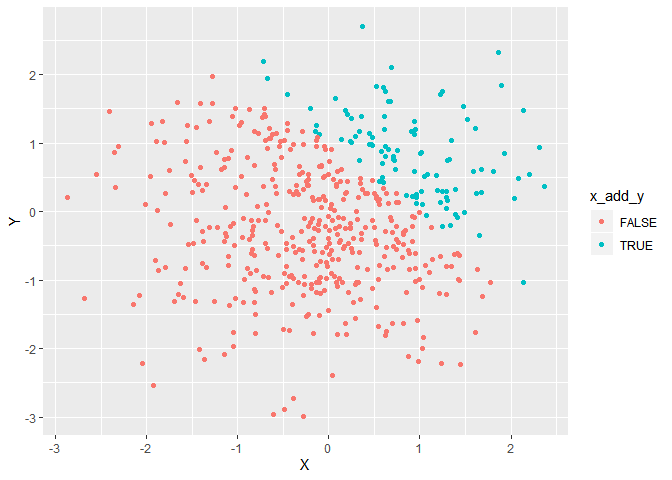
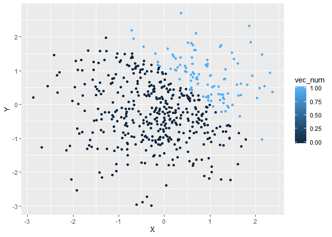

p8105\_hw1\_fj2269
================
Fangming Jin
2019/9/13

## Homework 1

## Question 1

### Step 1: Create a data frame, calculate the mean of each variable

``` r
library(tidyverse)
```

    ## -- Attaching packages ------------------------------------------- tidyverse 1.2.1 --

    ## √ ggplot2 3.2.1     √ purrr   0.3.2
    ## √ tibble  2.1.3     √ dplyr   0.8.3
    ## √ tidyr   0.8.3     √ stringr 1.4.0
    ## √ readr   1.3.1     √ forcats 0.4.0

    ## -- Conflicts ---------------------------------------------- tidyverse_conflicts() --
    ## x dplyr::filter() masks stats::filter()
    ## x dplyr::lag()    masks stats::lag()

``` r
frame_one = tibble(
  norm_samp = rnorm(8),
  norm_samp_pos = norm_samp > 0,
  vec_char = c("Baggins", "Melkor", "Manwe", "Sauron", "Feanor", "Fingolfin", "Finarfin", "Luthien"),
  vec_factor = factor(c("Hobbit", "God", "God", "God", "Elf", "Elf", "Elf", "Elf"),order=TRUE,levels = c("Hobbit","Elf","God"))
)

mean(pull(frame_one, norm_samp))
mean(as.numeric(pull(frame_one, norm_samp_pos)))
mean(as.numeric(pull(frame_one, vec_char)))
mean(as.numeric(pull(frame_one, vec_factor)))
```

*Factor vector and logical vector can be converted to numeric and
calculate mean for ordinal variable and binary variable in them is
ranked. Character vector does not have level and does not have
mean.*

### Step 2: Transform the type of logical vector and multiple random sample

``` r
as.numeric(pull(frame_one, norm_samp_pos))*pull(frame_one, norm_samp)
```

    ## [1] 0.000000 1.149128 1.525452 0.000000 1.797267 0.000000 0.000000 1.230126

``` r
as.factor(pull(frame_one, norm_samp_pos))*pull(frame_one, norm_samp)
```

    ## [1] NA NA NA NA NA NA NA NA

``` r
as.numeric(as.factor(pull(frame_one, norm_samp_pos)))*pull(frame_one, norm_samp)
```

    ## [1] -0.2676653  2.2982562  3.0509035 -0.2641927  3.5945348 -1.1301450
    ## [7] -0.8979589  2.4602522

*Only When the two vector are both numeric vector can they multiple with
each other.*

*When binary variables without level were convert to numeric, TRUE turns
to 1 and FALSE turn to 0. In contrary, when we use as.numeric, variables
in factor vector are converted from 1 to n according to level. For
binary variables in factor vector, TRUE turns to 2 and FALSE turns to
1.*

## Question 2

### Step 1: Create another data frame and describe it

``` r
frame_two = tibble(
  x = rnorm(500),
  y = rnorm(500),
  x_add_y = x + y > 1,
  vec_num = as.numeric(x_add_y),
  vec_fac = as.factor(x_add_y)
)
```

*This frame have 500 row and 5 column.*

*The mean of x is -0.0316123, the median of x is -0.0074874, the
standard deviation of x is 0.9562239.*

*The proportion of cases for which x + y \> 1 is
0.2.*

### Step 2: Make three scatterplot of x vs y

``` r
ggplot(frame_two,aes(x = x, y = y,color = x_add_y)) + geom_point(shape=19) +
    xlab("X") + ylab("Y")
```

<!-- -->

``` r
ggsave("scatter_plot_one.pdf")
```

    ## Saving 7 x 5 in image

``` r
ggplot(frame_two,aes(x = x, y = y,color = vec_num)) + geom_point(shape=19) +
    xlab("X") + ylab("Y")
```

<!-- -->

``` r
ggplot(frame_two,aes(x = x, y = y,color = vec_fac)) + geom_point(shape=19) +
    xlab("X") + ylab("Y")
```

<!-- -->

*The three scatterplot all have two kind of color, The color scale of
first and third scatterplot is the same, red and blue. The color of plot
in second graph is dark blue and light blue.*
